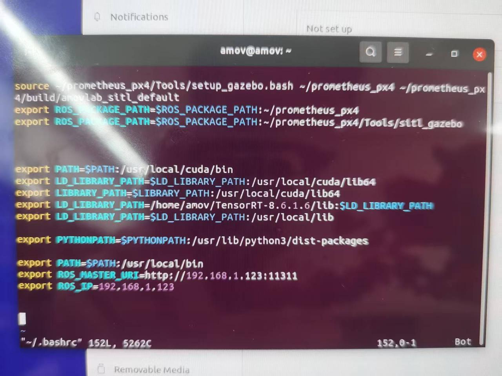

# 有关ros的一些配置：
只需要配置ROS_MASTER_URI和ROS_IP两个参数即可
- ROS_IP配置为其本身ip地址
- ROS_MASTER_URI配置器需要连接的ros_core的ip和端口，因为我们是多ros_core架构，所以同样配置为本身ip+端口



# 创建项目包
## 创建项目文件
mkdir -p ~/catkin_ws/src
## 创建ROS包
cd ~/catkin_ws/src

catkin_create_pkg my_topic_pkg roscpp std_msgs  # 依赖roscpp和std_msgs

cd ~/catkin_ws

catkin_make

# 通过ros_bridge组件获取其他roscore节点的话题

这里我们假设中控ip为192.168.1.123

无人机ip为192.123.1.11

中控要读取无人机的/chat话题，类型为std_msgs/String

## 安装 rosbridge

`sudo apt-get update`

`sudo apt-get install ros-noetic-rosbridge-suite`

## 话题订阅（python方法）

### 方法一 通过Python WebSocket 库
1. 安装 Python WebSocket 库：
`pip3 install websocket-client`
（因为ros默认使用python3）


2. Python脚本添加可执行权限`chmod +x scripts/WebSocket.py`

3.  确保package.xml文件中包含对rospy的依赖声明

`<build_depend>rospy</build_depend>`

`<exec_depend>rospy</exec_depend>`

4. 修改CMakeLists.txt 
```
catkin_install_python(PROGRAMS
  scripts/talker.py
  # 如果有多个脚本，在此处继续添加
  scripts/listener.py
  DESTINATION ${CATKIN_PACKAGE_BIN_DESTINATION}
)
```
5. 编译与运行

`cd ~/catkin_ws`

`catkin_make`

刷新环境 `source devel/setup.bash`

运行节点 `rosrun my_python_pkg WebSocket.py`

### 方法二 通过Python roslibpy 库
- 安装 Python roslibpy 库：
`pip3 install roslibpy`
（因为ros默认使用python3）
- 其余同上